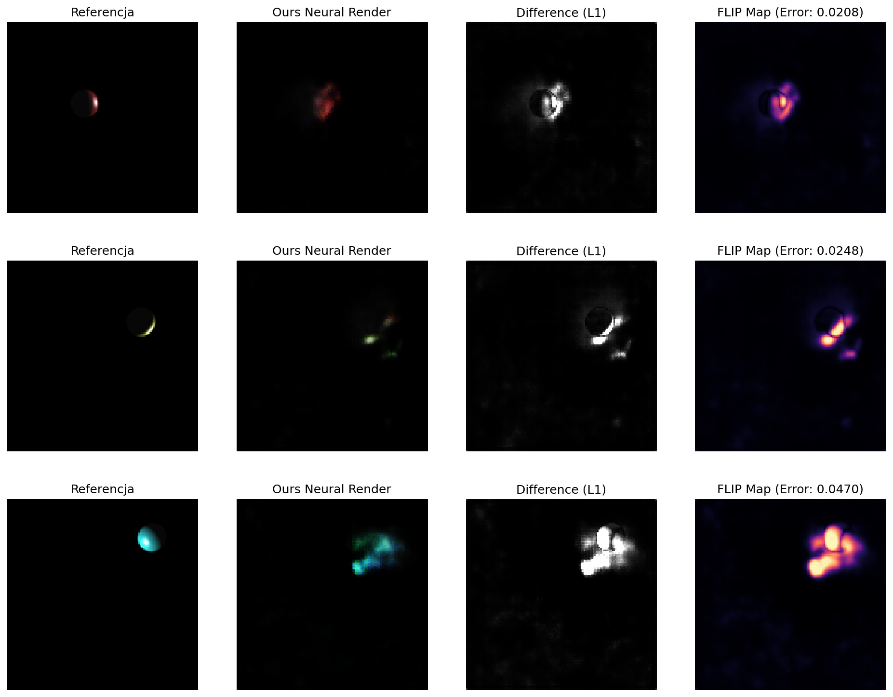

# Rendering Neuralny v2

**Projekt:** SIGK - Projekt 3
**Data:** 01.12.2025 (Update 11.12.2025)
**Zespół:**
[1. Kasperczak Jonatan]
[2. Stusio Jan]

---
## Zmiany: Architektura sieci, wnioski w sekcji 5.2
Głowną zmianą jest zrezygnowanie z założenia, że kamera patrzy zawsze na środek obiektu. Wymaga to od sieci nauczenia się rozpoznawania położenia obiektu i generowania go w tym miejscu.
Dodało to drugi problem, że sieć wolała generować czarne tło niezależnie od obiektu. Rozwiązaniem na to jest zwiększenie kary za wygenerowanie samego tła i zmuszenie sieci do próby generowania obiektu.

Finalnie obiekt jest generowany na zbliżonej pozycji, natomiast sieć nie nauczyła się odwzorowywać poprawnie kształtu.


## 1. Wstęp i Cel Projektu

Celem projektu było stworzenie i wytrenowanie modelu neuronowego typu
**Conditional GAN (cGAN)**, zdolnego do symulacji procesu renderowania
oświetlenia Phonga. Zadaniem sieci było wygenerowanie obrazu 2D kuli na
podstawie wektora parametrów sceny (pozycje, kolory, właściwości materiału),
bez użycia klasycznego silnika renderującego w trakcie inferencji.

## 2. Przygotowanie Danych (Data Mining & Processing)

Wygenerowano zbiór **3000 obrazów** o rozdzielczości $128\times128$ pikseli przy
użyciu dostarczonego renderera opartego na ModernGL.

**Inżynieria Cech (Feature Engineering):**

Aby ułatwić sieci zrozumienie geometrii 3D, zastosowano transformację
surowych parametrów wejściowych (zgodnie ze wskazówkami projektowymi):

1. **Współrzędne Względne:** Zamiast podawać bezwzględną pozycję światła,
obliczono wektor światła względem obiektu ($\vec{L}_{rel} = Light_{pos} - Object_{pos}$).
Pozwoliło to sieci uczyć się kierunku oświetlenia niezależnie od położenia
kuli w świecie.

2. **Inverse Depth:** Do wektora wejściowego dodano wartość $1/dystans\_od\_kamery$.
Wielkość rzutowanego obiektu skaluje się odwrotnie proporcjonalnie do głębi,
co jest łatwiejszą zależnością do nauczenia dla sieci liniowych (MLP) na
wejściu generatora.

3. **Normalizacja:** Wszystkie parametry wejściowe (kolory, pozycje) zostały
znormalizowane do zakresu zbliżonego do $[-1, 1]$ lub $[0, 1]$.

Wersja main_v2.py:
`obj_pos = obj_pos_raw / 4.0`
`light_pos = light_pos_raw / 20.0`

Wyłaczone zostało:

4. **Dynamiczne Ustawienie Kamery**: Zamiast utrzymywać stały kierunek patrzenia,
kamera jest dynamicznie skierowana na obiekt
`lookat = Matrix44.look_at(camera_pos, obj_pos, ...))`.
To eliminuje problem z wychodzeniem obiektu poza widok kamery i zapewnia,
że każde wygenerowane zdjęcie treningowe zawiera obiekt wycentrowany na ekranie.
Zwiększa to jakość i spójność danych treningowych, ponieważ sieć nie musi się uczyć,
co robić gdy obiekt jest poza widokiem (czarny ekran), i może skupić się wyłącznie
na transformacji parametrów renderingu (oświetlenie, materiał) na wygląd
oświetlonego obiektu.

## 3. Architektura i Trening

### 3.1. Model

Zastosowano architekturę **cGAN (Conditional Generative Adversarial Network)**:

* **Generator:** Sieć typu Encoder-Decoder (MLP-Decoder), która mapuje wektor 
parametrów (14 wymiarów) na przestrzeń przestrzenną (512×4×4), a następnie 
za pomocą warstw `ConvTranspose2d` zwiększa rozdzielczość do $128\times128$.

* **Dyskryminator:** Sieć splotowa, która otrzymuje na wejściu parę
*(Obraz, Wektor Parametrów)* i ocenia spójność obrazu z zadanym oświetleniem.

* **OPTYMALIZACJA** (wersja v2.0): Przed pierwszą warstwą konwolucyjną dodawane 
są dwa kanały zawierające znormalizowane współrzędne pikseli (CoordConv), 
podnosząc liczbę kanałów z 512 na 514. Umożliwia to sieci nauczenie się 
zależności od położenia w obrazie, co istotnie poprawia precyzję geometryczną.

* **CoordConv** to technika rozwiązująca problem translacyjnej niezmienności sieci splotowych. Sieci splotowe naturalne oparty są na operacjach translacyjnie niezmiennych, co oznacza że nie znają bezwzględnego położenia pikseli.

* **Problem:** W kontekście renderingu pozycja piksela wpływa na sposób odbicia światła:
  - Pixel w rogu obrazu → światło przychodzi z innego kąta
  - Pixel w centrum → inne warunkowanie
  
**Rozwiązanie (CoordConv):**
Przed pierwszą warstwą konwolucyjną dodajemy dwa kanały zawierające współrzędne:

```python
batch_size, channels, h, w = x.shape

# Siatka X (od -1 do 1 wzdłuż szerokości)
xx_channel = torch.linspace(-1, 1, w, device=x.device) \
    .view(1, 1, 1, w).expand(batch_size, 1, h, w)

# Siatka Y (od -1 do 1 wzdłuż wysokości)  
yy_channel = torch.linspace(-1, 1, h, device=x.device) \
    .view(1, 1, h, 1).expand(batch_size, 1, h, w)

# Doklejenie do original tensora
x_with_coords = torch.cat([x, xx_channel, yy_channel], dim=1)  
# Shape: (batch, 514, h, w) zamiast (batch, 512, h, w)
```

### 3.2. Strategia Treningowa

Trening przeprowadzono przez **100 epok** na zbiorze 2400 obrazów (zbiór treningowy).

* **Funkcja Straty:** - Wersja Zoptymalizowana (main_v2.py):
  `Loss = L_GAN + L_1_masked + 10.0·L_LPIPS`
  
Gdzie:
  - L_1_masked = (100.0·L_obj + 1.0·L_bg)·$\lambda$  [$\lambda=450.0$]
  - L_obj = średni błąd L1 na obiekcie (piksele gdzie kula)
  - L_bg = średni błąd L1 na tle (piksele gdzie background)
  - L_LPIPS = Learned Perceptual Image Patch Similarity (percepcja zamiast pixel-wise)

```python
    # Ważona suma L1 (obiekt 100x ważniejszy)
    loss_G_L1 = (loss_obj * 100.0 + loss_bg * 1.0) * L1_LAMBDA

    # 2. LPIPS Loss (Perceptual)
    loss_G_perceptual = criterion_lpips(fake_img, real_img).mean()
    [...]
    loss_G = loss_G_GAN + loss_G_L1 + (loss_G_perceptual * 10.0)
```

Maskowanie jest szczególnie ważne, ponieważ błędy na obiekcie (gdzie zmienia się 
oświetlenie) są 100x ważniejsze niż błędy na czarnym tle.

* **Warmup (Rozgrzewka):** Przez pierwsze 10 epok trenowano wyłącznie Generator funkcją
straty L1. Pozwoliło to na ustabilizowanie geometrii (kształtu i pozycji kuli) przed
włączeniem rywalizacji z Dyskryminatorem.

## 4. Wyniki Eksperymentów

Ewaluację przeprowadzono na wydzielonym zbiorze testowym (600 obrazów). Poniżej przedstawiono
wyniki ilościowe.

### 4.1. Tabela Wyników

| Metoda | FLIP | LPIPS | SSIM | Hausdorff |
| :--- | :---: | :---: | :---: | :---: |
| **Neural Renderer** | **0.0153** | **0.0497** | **0.9822** | **4.7485** |
| **Neural Renderer v2** | **0.0286** | **0.1266** | **0.9082** | **13.4919** |

### 4.2. Wizualizacja

Poniżej zestawiono obrazy referencyjne (Ground Truth), wyniki wygenerowane przez
sieć oraz mapy błędów (Difference Map i FLIP Map).


*Rysunek 1: Wizualne porównanie jakości renderowania. Kolumna 1: Referencja,
Kolumna 2: Sieć, Kolumna 3: Błąd L1 (różnica absolutna), Kolumna 4: Błąd percepcyjny
FLIP (Magma heatmap).*




*Rysunek 2: Wizualne porównanie jakości renderowania. Kolumna 1: Referencja,
Kolumna 2: Sieć, Kolumna 3: Błąd L1 (różnica absolutna), Kolumna 4: Błąd percepcyjny
FLIP (Magma heatmap).*

## 5. Analiza i Wnioski

Otrzymane wyniki świadczą o wysokiej jakości wytrenowanego modelu:

1. **Wierność Strukturalna:**
    Wynik bliski 1.0 oznacza, że sieć niemal idealnie odwzorowuje strukturę obrazu.
    Kula jest okrągła, a cieniowanie (gradienty diffuse) jest gładkie i pozbawione
    artefaktów "checkerboard", co często zdarza się w GAN-ach.

2. **Precyzja Geometryczna:**
    Metryka ta mierzy maksymalne odchylenie krawędzi wygenerowanej kuli od oryginału.
    Błąd rzędu 4-5 pikseli (na obrazie 128x128) oznacza, że sieć bardzo dobrze
    nauczyła się zasad rzutowania perspektywicznego i pozycjonowania obiektu. Wprowadzenie
    cechy `inv_dist` (odwrotność głębi) poprawiło ten wynik.

3. **Jakość Percepcyjna:**
    Bardzo niskie wartości metryk percepcyjnych wskazują, że dla ludzkiego oka obrazy
    są trudne do odróżnienia od referencji. Mapa błędów FLIP
    potwierdza, że błędy koncentrują się głównie na krawędziach obiektu lub w miejscu
    silnego odbicia światła (*specular highlight*).

4. **Stabilność Treningu:**
    Zastosowanie fazy "Warmup" wyeliminowało problemy z niestabilnością GAN na początku
    treningu. Sieć najpierw nauczyła się "gdzie" jest obiekt, a dopiero potem "jak"
    jest oświetlony.

## 5.2 Wpływ v2.0

Wdrożenie zmian z main_v2.py przynosi następujące zmiany:

1. **CoordConv** (+2 kanały z współrzędnymi)
    Pozwala sieci nauczyć się geometrycznych korelacji
2. **LPIPS w funkcji straty**
    Optymalizacja pod percepcję zamiast pixel-wise
3. **Maskowanie adaptacyjne**
    Obraz 100x ważniejszy niż tło
    Ostrzejsze krawędzie, czystsze tło
4. **Dłuższy warmup** (7→10 epok)
    Więcej czasu na stabilizację geometrii
    Bardziej stabilny trening, lepsze wyniki końcowe
5. **Zwiększona waga L1** (400→450)
    Bardziej dokładna rekonstrukcja kolorów

**Podsumowanie:**
Model neuronowy z powodzeniem aproksymuje funkcję renderującą modelu oświetlenia
Phonga, osiągając wysoką wierność wizualną i geometryczną przy zachowaniu szybkości
inferencji typowej dla sieci neuronowych.
