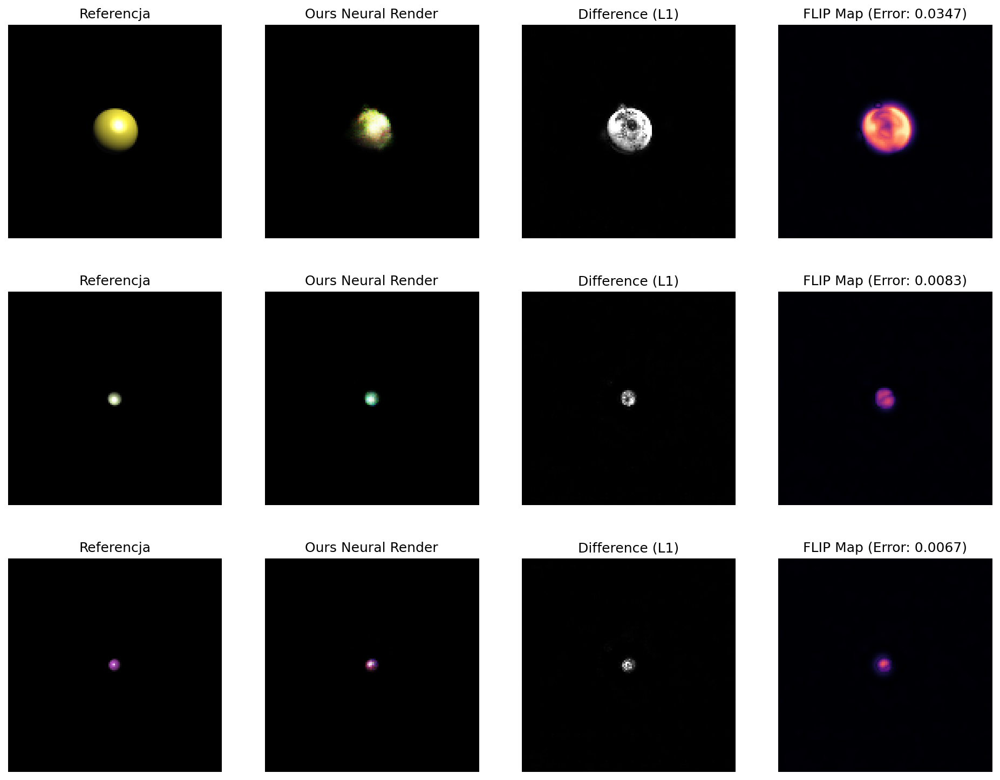

# Rendering Neuralny

**Projekt:** SIGK - Projekt 3
**Data:** 01.12.2025
**Zespół:**
[1. Kasperczak Jonatan]
[2. Stusio Jan]

---

## 1. Wstęp i Cel Projektu

Celem projektu było stworzenie i wytrenowanie modelu neuronowego typu
**Conditional GAN (cGAN)**, zdolnego do symulacji procesu renderowania
oświetlenia Phonga. Zadaniem sieci było wygenerowanie obrazu 2D kuli na
podstawie wektora parametrów sceny (pozycje, kolory, właściwości materiału),
bez użycia klasycznego silnika renderującego w trakcie inferencji.

## 2. Przygotowanie Danych (Data Mining & Processing)

Wygenerowano zbiór **3000 obrazów** o rozdzielczości $128\times128$ pikseli przy
użyciu dostarczonego renderera opartego na ModernGL.

**Inżynieria Cech (Feature Engineering):**

Aby ułatwić sieci zrozumienie geometrii 3D, zastosowano transformację
surowych parametrów wejściowych (zgodnie ze wskazówkami projektowymi):

1. **Współrzędne Względne:** Zamiast podawać bezwzględną pozycję światła,
obliczono wektor światła względem obiektu ($\vec{L}_{rel} = Light_{pos} - Object_{pos}$).
Pozwoliło to sieci uczyć się kierunku oświetlenia niezależnie od położenia
kuli w świecie.

2. **Inverse Depth:** Do wektora wejściowego dodano wartość $1/dystans\_od\_kamery$.
Wielkość rzutowanego obiektu skaluje się odwrotnie proporcjonalnie do głębi,
co jest łatwiejszą zależnością do nauczenia dla sieci liniowych (MLP) na
wejściu generatora.

3. **Normalizacja:** Wszystkie parametry wejściowe (kolory, pozycje) zostały
znormalizowane do zakresu zbliżonego do $[-1, 1]$ lub $[0, 1]$.

4. **Dynamiczne Ustawienie Kamery**: Zamiast utrzymywać stały kierunek patrzenia,
kamera jest dynamicznie skierowana na obiekt
`lookat = Matrix44.look_at(camera_pos, obj_pos, ...))`.
To eliminuje problem z wychodzeniem obiektu poza widok kamery i zapewnia,
że każde wygenerowane zdjęcie treningowe zawiera obiekt wycentrowany na ekranie.
Zwiększa to jakość i spójność danych treningowych, ponieważ sieć nie musi się uczyć,
co robić gdy obiekt jest poza widokiem (czarny ekran), i może skupić się wyłącznie
na transformacji parametrów renderingu (oświetlenie, materiał) na wygląd
oświetlonego obiektu.

## 3. Architektura i Trening

### 3.1. Model

Zastosowano architekturę **cGAN (Conditional Generative Adversarial Network)**:

* **Generator:** Sieć typu Encoder-Decoder (lub MLP-Decoder), która mapuje wektor
parametrów (14 wymiarów) na przestrzeń przestrzenną, a następnie za pomocą warstw
`ConvTranspose2d` zwiększa rozdzielczość do $128\times128$.

* **Dyskryminator:** Sieć splotowa, która otrzymuje na wejściu parę
*(Obraz, Wektor Parametrów)* i ocenia spójność obrazu z zadanym oświetleniem.

### 3.2. Strategia Treningowa

Trening przeprowadzono przez **100 epok** na zbiorze 2400 obrazów (zbiór treningowy).

* **Funkcja Straty:** Zastosowano hybrydową funkcję straty:
$Loss = L_{GAN} + \lambda \cdot L_{1}$,
gdzie $\lambda=50$. Wysoka waga L1 wymusza poprawność kolorystyczną i geometryczną.

* **Warmup (Rozgrzewka):** Przez pierwsze 5 epok trenowano wyłącznie Generator funkcją
straty L1. Pozwoliło to na ustabilizowanie geometrii (kształtu i pozycji kuli) przed
włączeniem rywalizacji z Dyskryminatorem.

## 4. Wyniki Eksperymentów

Ewaluację przeprowadzono na wydzielonym zbiorze testowym (600 obrazów). Poniżej przedstawiono
wyniki ilościowe.

### 4.1. Tabela Wyników

| Metoda | FLIP | LPIPS | SSIM | Hausdorff |
| :--- | :---: | :---: | :---: | :---: |
| **Neural Renderer** | **0.0153** | **0.0497** | **0.9822** | **4.7485** |

### 4.2. Wizualizacja

Poniżej zestawiono obrazy referencyjne (Ground Truth), wyniki wygenerowane przez
sieć oraz mapy błędów (Difference Map i FLIP Map).

*Rysunek 1: Wizualne porównanie jakości renderowania. Kolumna 1: Referencja,
Kolumna 2: Sieć, Kolumna 3: Błąd L1 (różnica absolutna), Kolumna 4: Błąd percepcyjny
FLIP (Magma heatmap).*

## 5. Analiza i Wnioski

Otrzymane wyniki świadczą o wysokiej jakości wytrenowanego modelu:

1. **Wierność Strukturalna:**
    Wynik bliski 1.0 oznacza, że sieć niemal idealnie odwzorowuje strukturę obrazu.
    Kula jest okrągła, a cieniowanie (gradienty diffuse) jest gładkie i pozbawione
    artefaktów "checkerboard", co często zdarza się w GAN-ach.

2. **Precyzja Geometryczna:**
    Metryka ta mierzy maksymalne odchylenie krawędzi wygenerowanej kuli od oryginału.
    Błąd rzędu 4-5 pikseli (na obrazie 128x128) oznacza, że sieć bardzo dobrze
    nauczyła się zasad rzutowania perspektywicznego i pozycjonowania obiektu. Wprowadzenie
    cechy `inv_dist` (odwrotność głębi) poprawiło ten wynik.

3. **Jakość Percepcyjna:**
    Bardzo niskie wartości metryk percepcyjnych wskazują, że dla ludzkiego oka obrazy
    są trudne do odróżnienia od referencji. Mapa błędów FLIP
    potwierdza, że błędy koncentrują się głównie na krawędziach obiektu lub w miejscu
    silnego odbicia światła (*specular highlight*).

4. **Stabilność Treningu:**
    Zastosowanie fazy "Warmup" wyeliminowało problemy z niestabilnością GAN na początku
    treningu. Sieć najpierw nauczyła się "gdzie" jest obiekt, a dopiero potem "jak"
    jest oświetlony.

**Podsumowanie:**
Model neuronowy z powodzeniem aproksymuje funkcję renderującą modelu oświetlenia
Phonga, osiągając wysoką wierność wizualną i geometryczną przy zachowaniu szybkości
inferencji typowej dla sieci neuronowych.
